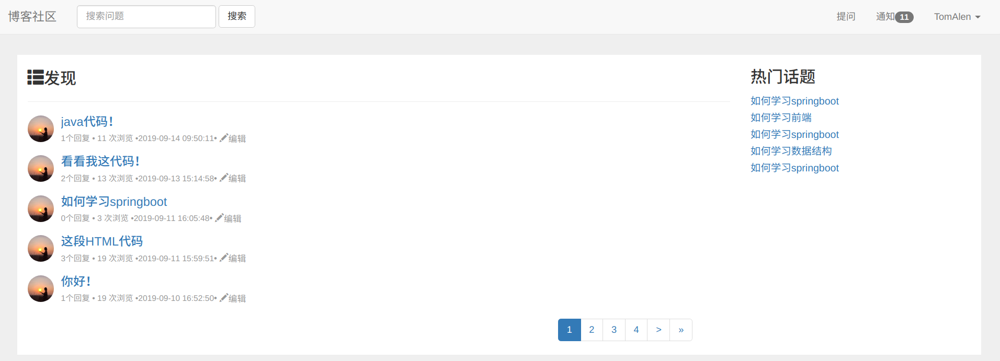
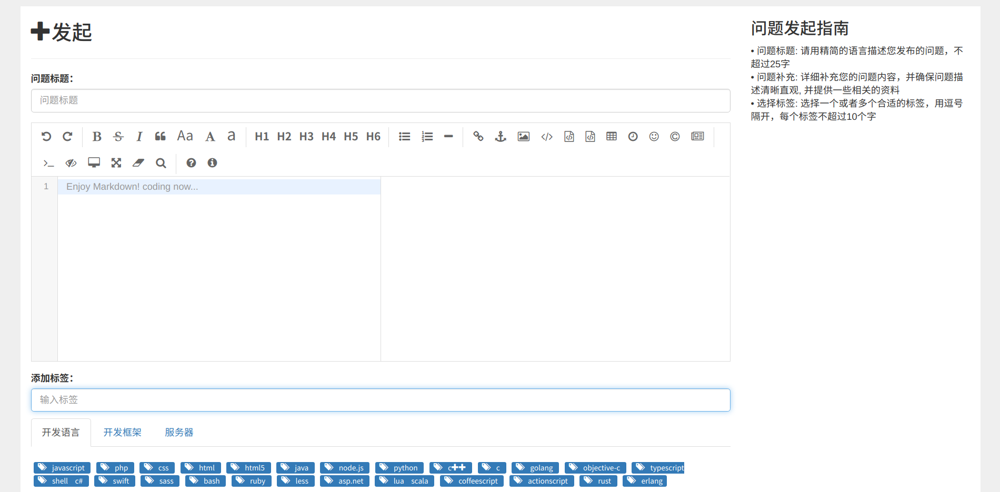
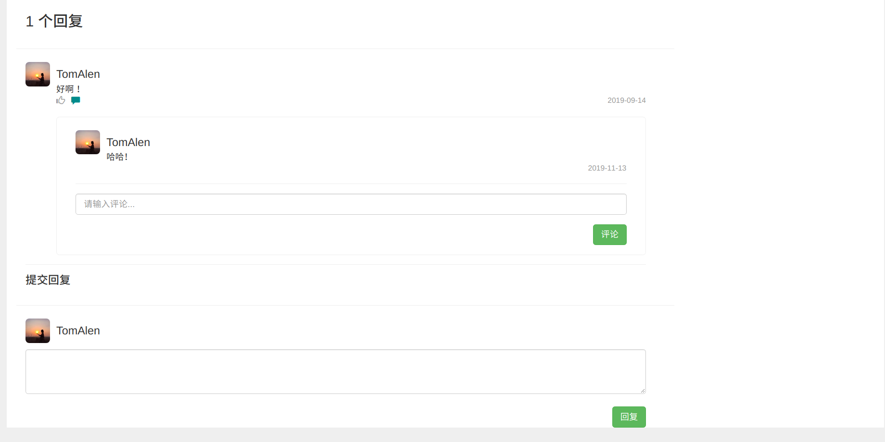
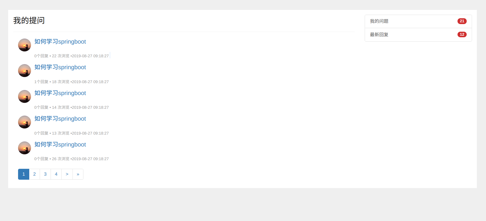

# SpringBoot整合Thymeleaf模板--博客社区系统
## 项目演示
### 登录

* 登录的实现为github第三方授权登录，使用的是单点登录，技术实现为点击登录后后台去查找存入数据库的cookie值，在浏览器中会自动保存上一次的cookie值，进行匹配，如果有就登录成功，如果没有就进插入操作，即第三方授权登录。
* 右方的热门话题则是通过查询数据库中的浏览数，取出前五个最大浏览数的话题。 
### 提问

提问的实现调用了第三方的markdown语法的js库，支持markdown语法，可以选择提问的标签，提问成功后返回主页面进行问题的展示。
### 回复

回复评论，设置一个标识（评论或者二级评论），对他们进行相应的处理，得到他们的父类Id，进行插入评论操作。
### 我的问题

我的问题页面，查询自己提问的问题，以及可以查自己的回复通知列表
### 我的回复

我的回复功能由后台查询自己的回复的问题，将问题查出，将刚评论的问题添加未读标识，当点击问题的阅读后将未读标识改为已读，

